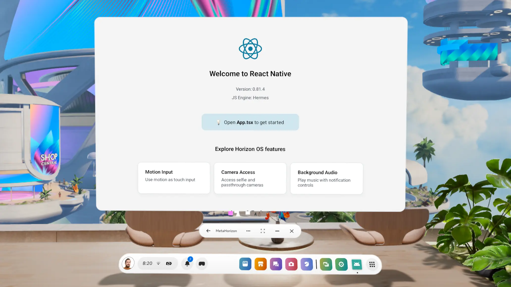

# React Native for Meta Horizon OS

This project demonstrates that **React Native applications can run natively on Meta Horizon OS** with full performance and feature parity. No compromises, no limitations – just the familiar React Native development experience you already know, now available in virtual reality.

<div align="center">
  
</div>

## 🌟 What This Proves

**React Native Works in VR**: This project proves that React Native can be used to build applications for Meta Horizon OS and virtual reality devices like Meta Quest 3. The same framework that powers millions of mobile apps can now power immersive VR experiences.

**Zero Performance Compromises**: React Native runs natively on Meta Horizon OS with the same performance characteristics as mobile platforms. Your apps maintain smooth 60fps performance, responsive interactions, and fluid animations in virtual reality.

**Familiar Development Experience**: If you can build React Native apps for Android or iOS, you can build them for VR. The development workflow, debugging tools, hot reloading, and APIs work exactly the same way.

**Easy Porting from Mobile**: Existing React Native Android applications can be adapted for Meta Horizon OS with minimal changes. Your components, business logic, and state management patterns transfer directly to VR development.

## 🚀 Technical Capabilities

**Native Performance**: React Native applications run with native performance on Meta Horizon OS, leveraging the same JavaScript engine and native bridge architecture that powers mobile apps.

**Full API Access**: Complete access to Meta Horizon OS APIs through React Native's native module system. Camera, sensors, controllers, and VR-specific features are all accessible.

**Standard React Native Patterns**: All familiar React Native patterns work in VR – components, hooks, navigation, state management, and third-party libraries function identically.

**Development Tools**: Full support for React Native development tools including Metro bundler and hot reloading in the VR environment.

## 🛠️ Development Setup

### Prerequisites

- Meta Quest 3 (or compatible Meta Horizon OS device)
- Meta Horizon OS development environment
- [React Native development environment](https://reactnative.dev/docs/set-up-your-environment)

### Installation

1. **Clone the Repository**

   ```bash
   git clone https://github.com/callstack/react-native-horizonos-example/
   cd react-native-horizonos-example
   ```

2. **Install Dependencies**

   ```bash
   pnpm install
   ```

3. **Start Development Server**

   ```bash
   pnpm start
   ```

4. **Deploy to Meta Horizon OS**

   ```bash
   pnpm run quest
   ```

## 📱 Demo Features

This demo application showcases various React Native capabilities in VR:

- **Camera Integration**: Access to both selfie and passthrough cameras
- **Audio Playback**: Background music with system notification controls
- **Link Sharing**: Standard React Native sharing functionality

## 🎮 Interaction Methods

React Native apps in Meta Horizon OS support multiple interaction patterns:

- **Meta Quest Controllers**: Traditional VR controller input
- **Hand Tracking**: Finger-based interaction when enabled

## 🖥️ Display & Interface

React Native applications render as horizontal panels within the Meta Horizon environment, optimized for VR viewing angles and interaction patterns. The same UI components that work on mobile adapt seamlessly to the virtual environment.

## 📦 Third-Party Libraries

This project leverages several key third-party libraries to provide a rich development experience:

### Navigation & UI

- **React Navigation**: Complete navigation solution with native stack and gesture support
- **React Native Screens**: Native screen management for better performance
- **React Native Safe Area Context**: Safe area handling for different device layouts

### Animation & Interactions

- **React Native Reanimated**: High-performance animation library with native driver support
- **React Native Gesture Handler**: Native gesture recognition and handling
- **React Native Worklets**: JavaScript functions that run on the UI thread

### Media & Camera

- **React Native Vision Camera**: Advanced camera functionality with frame processing
- **React Native Track Player**: Full-featured audio playback with background support
- **React Native SVG**: SVG rendering support for scalable graphics

### Icons & Assets

- **Lucide React Native**: Comprehensive icon library with 1000+ icons

### Utilities

- **React Native Restart**: Application restart functionality

## 📚 Learn More

- [Meta Horizon OS Documentation](https://developer.oculus.com/)
- [React Native Documentation](https://reactnative.dev/docs/getting-started)
- [Meta Quest Development](https://developer.oculus.com/documentation/)

## 🐛 Troubleshooting

Common development issues and solutions:

- Meta Quest connection and setup
- Meta Horizon OS environment configuration
- React Native dependency management
- VR-specific debugging techniques

## 📄 License

This project is licensed under the MIT License - see the LICENSE file for details.
